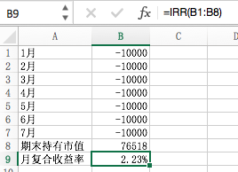

从来不知道理财的我最近不知道咋回事开始关注了！于是乎就找了一本来看看，好吧我被说动了，下面就是《指数基金投资指南》的主要内容，一般人的理财方式应当以稳健为主。推荐指数基金和债券结合来买，他们俩是负相关。一般指数基金涨债券可能就跌了，当牛市来了的时候指数基金太贵我们可以买债券和货币基金优点是灵活随用随取缺点是收益比较小。

买基金不怕跌，怕的是乱买一通。`纪律性`很重要，一定按时买别看高了就多买，跌了就少买，人对涨和跌的情感波动是不一样的。`纪律性`、`纪律性`、`纪律性`

## 挑选合适的指数基金
### 挑选指标

下面会介绍4个重要指标（可以在股票交易软件上查询），在考虑这4个指标时别忘了参考`流动性`和`盈利稳定性`作为参考。

__市盈率__：市值/盈利，即PE=P/E。

__盈利收益率__：盈利/市值，是`市盈率`的倒数，它衡量的是如果我们把一个公司全部买下来，每年能带给我们的收益。>10%投，<6.4%（就是债基的收益）抛

__市净率__：它是用公司市值/净资产，是从买资产的角度衡量公司。

__股息率__：它用现金分红/市值，股息率和盈利收益率关系密切，`盈利收益率`✖️`分红率`＝`股息率`。

> 价值和价格的关系就像牵着狗的人，人就是价值狗是价格，狗会围着价值转但是最终跟随人走向目标。

### 选股方式
#### 盈利收益率法
很简单就是参考`盈利收益率`当`盈利收益率`__大于__`10%`就加投，当__小于__`6.4%`就抛售。

这里的`10%`是盈利收益率要大幅高于同期无风险利率，截至2017年5月31日，无风险利率可以参考10年期国债收益率，在3.5%左右。无风险利率的两倍就是7%。而`6.4%`是来自债券基金的平均收益。国内债券基金的长期平均收益率在6.4%左右，即投资总要比债基表现好才行不然直接买债基了。

这里该方法一般要挑选`流动性`和`盈利稳定性`好的才有效，譬如上证红利、中证红利、上证50、基本面50、上证50AH优选、央视50、恒生指数和恒生中国企业指数等。

#### 博格公式法
该法认为`决定长期回报`的最关键三个因素：`初始投资时刻的股息率`、`投资期内的市盈率变化`、`投资期内的盈利增长率`。

> 复合收益率 = 指数基金的初期股息率 + 指数基金每年的市盈率变化率 + 指数基金的每年的盈利变化率

## 定投
### 懒人定投
__好处__：

* 不需要很多钱也可以开始定投。
* 定投对投资时机要求不高。
* 定投可以分摊成本，化腐朽为神奇。

__如何定投__：

* 时间：
    + 选一个固定时间，时间一旦确定就不要变，推荐工资后一天，这样的纪律性是为了屏蔽主观情绪对投资的影响，别股市下跌不敢买，等涨了后悔买的少，定投时间一般不会短少则也是`3`年，把它当做`储蓄`来看。
* 金额：
    + 定投的金额肯定是因人而异，一般建议在不影响生活的情况下投资，譬如每个月除了生活必须开支后剩下的钱是4000块，那么拿出2000块去定投是一个不错的选择。为啥不是所有钱？主要是定投要求资金几年内不动，所以要留出一部分以备生活的不时之需。

上面介绍的是傻瓜是定投。

__误区__：

> 指数基金好久自始至终去投，不管贵贱。

这是一个常见的误区，不管什么都会有一个他的价值，如果一元一斤的西瓜还不错，但是如果200元一斤的西瓜显然就失去了它本身的价值，指数基金也一样。

尽管指数基金相对于其他的股票基金好处那么多但是我们也要去关乎它的价值而且最好在价格低于价值时候去买。那么如果判断价格和价值的关系呢？参考上一节并运用：
> 只在指数基金被低估的时候定投，在指数基金被高估的时候卖掉。

那不是一直买卖了吗？不是定投呀！不要疑惑，基金价值被误估的时间一般会比你定投的周期要长，所以在周期内还是定投的。

__盈利收益率法+定投__：

+ 在盈利收益率大于10%的时候坚持定投。 
+ 盈利收益率小于10%，大于6.4%的时候暂停定投，继续持有；可以定投其他盈利收益率大于10%的品种。
+ 盈利收益率小于6.4%的时候卖出。

__博格公式法＋定投__：

+ 在市盈率或市净率处于历史底部区域的时候坚持定投。
+ 市盈率市净率进入正常估值，暂停定投，继续持有；可以定投其他处于底部区域的品种。
+ 当市盈率市净率进入历史较高区域的时候卖出。

### 场内和场外
__优缺点对照表__:

||场内|场外|
|:-:|:-:|:-:|
|优点|交易迅速，到账快；交易费用低；追踪指数更准确|可自动买卖；基金数量多|
|缺点|手动买卖；基金数量少|交易慢，到账慢；交易费用高|

### 计算收益率
收益和收益率都好算，这里主要是说复合收益率，复合收益率比较难采用的是`IRR`公式，这里我们借用Excel来帮我们计算参考下图

 

既我们在表格中B1到B7里填上每个月的定投金额，并在B8填入期末市值，然后在B9输入`=IRR(B1:B8)`回车便得到结果

### 定期不定额
定期不定额作用两个，`定期`是为了纪律性，大多数人的纪律性都比较差，差的纪律性甚至可能导致投资基金失败，这个很重要，确定了日期就不要乱动。
`不定额`是为了放大收益，毕竟基金的价值也是有起伏的，在估值低的时候买能获得更多的利润，那么要买多少呢？

__盈利收益率法__： $ 首次低谷时的定投资金\times\; (\dfrac{当月的盈利收益率}{首次的盈利收益率})^n $ 

假设我们从盈利收益率为`10%`的时候定投，初始为每个月1000元，n为1，这样到第二个月我们发现盈利收益率达到了`12.5%`，指数基金投资价值变高了，根据公式来计算，为我们需要投1250元。$ 1000\times\;(\dfrac{12.5%}{10%})^1 = 1250 $

__博格公式__： $ 首次低估是的定投资金\times\;(\dfrac{首次的市净率}{当月的市净率})^n $

上面的公式里都用一个`n`，它就是定投收益的放大器，对进一步提升我们的收益起很重要的作用。只要是普通定期定额投放时盈利的，那么n就能放大我们的收益。

> 定投放大器n，能够放大我们的投资收益，但是对资金的需求量会随着n的增大而越来越高，而且这种增高是呈几何倍数增长的。n的数值越大，当指数基金越低估时，要求投入的资金量就越多，因此投资者要量力而行，设置适合自己的放大器，根据自己能够承受的资金额度来设定n的取值。从我的经验来看，设置n＝1，效果就已经不错了。有条件的、资金比较多的朋友，可以设置n＝2，也就足够了。

> 这里要注意一点，家庭中打算投资股票资产的比例，最好不要低于30%，低于`30%`的投资对于家庭总资产的收益提升作用不明显。具体该如何操作呢？可参考下面的案例。
> 
> 假如我们有100万元可以投资于指数基金，我们可以分20个月进行定投。先将100万元分成20份，每份5万元。取第一份5万元，定投到当前市场中满足条件的低估的指数基金中。剩余的19份，共计95万元，可以投入到货币基金或债券基金中。随后的19个月，每个月再从货币基金或债券基金中提取5万元，定投到指数基金，直到配置完成。采取这种“资产配置+基金定投”的方式，轻轻松松就可以把手里的资金转化为生钱的资产了。