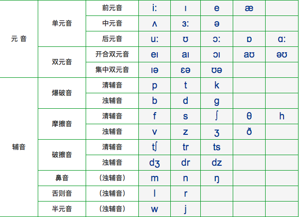

离开校园好几年英语接近于荒废状态。决定重新捡起来主要有两个原因，一个是因为良好的英语有助于接触上第一手信息（毕竟在好多领域英语系国家还是领先呀）；二是从长远来看也少不了，以后孩子什么的也能有个好点的语言环境。
<!-- more -->

### 常见发音规则

重读开音节里的元音一般发其`字母音`，有如下两种组合形式
> 重读开音节 = 元音 + 辅音 + e 或 辅音 + 元音

如： `rape`, `bate`, `rope`, `make`, `abuse`

重读闭音节里的元音一般发`短元音` [`æ,e,i,ɔ,ʌ,ʊ,ə`] 这些都是短元音，组合形式如下:
> 重读闭音节 = 元音 + 辅音

如：`rap`,`bat`,`rop`,`bus`,`egg`

[`ar,er,ir,or,ur`] 出现在单词前读[`ɜː`]出现在后面读[`ə(r)`] 如：`worker`

#### 短元音8个 
[`æ,e,i,ɔ,ʌ,ʊ,ə`] -> [哎，诶，以，奥，啊，乌，额]

|字母|可能发的音|
|:-:|:-:|
|a|e,æ,ə|
|e|ɪ,ε也写为e,ə|
|i|ai,ɪ,ə|
|o|o,a,ɔ,ə|
|u|ju,ʌ,ə,ʊ|

其中`ʊ`一般是由两个`o`来发音，如：`look`,`good`,`book`,`foot`

#### 长元音 [`i:,ɔ:,a:,ʊ:,ə:`]

|长元音|字母组合|单词|
|:-:|:-:|:-:|
|i:|`e`, `ea`, `ee`|me, be, he, we, sweet, see, bee, meat, eat, teach|
|ɔ:|`a`, `aw`, `al`, `or`|water, draw, ball, wall, horse, fork, or|
|a:|`a`, `ar`, `au`, `ear`|grass, class, fast, car, arm, dark, laugh, aunt, heart|
|ʊ:|`o`, `oo` ,`u`, `ui`|do, who, food, moon, fruit, juice, ruler, rude|
|ə:|`er`, `ir`, `ur`, `ear`, `or`|her, serve, term, bird, girl, first, nurse, curtain, early, learn, work|

#### 双元音 [`ai,au,ei,eə,iə,uə,ɔi,əu`]

|双元音|字母组合|单词|
|:-:|:-:|:-:|
|ai|i, y, ie, uy|kite, bike, nice, by, cry, my, tie, pie, buy|
|au|ou, ow|house, mouth, flower, how|
|ei|a, ai, ay|cak, mak, name, rain, wait, day, may, way|
|eə|air, ear|hair, chair, pair, pear, bear, wear|
|iə|ear, eer|ear, hear, tear, deer, beer|
|uə|oor, our, ure|poor, tour, sure, pure|
|ɔi|oi, oy|oil, boil, coin, boy, toy|
|əu|o, oa, ow|nose, rose, boat, cost, soap, show, window, snow|

#### 其他音

|音标|字母组合|单词|
|:-:|:-:|:-:|
|dʒ|g, j, ge|ginger, giraffe, jump, job, orange, cabbage|
|tʃ|ch, tch|teacher, peach, chair, watch, match|
|ʃ|s, sh|sugar, sure, ship, sheep, wash, she|
|dz|ds, des|seeds, woods, friends, beds, rides|
|ts|ts, tes|seats, cats, goats, gates, tastes, kites|
|ʒ|s|television, usually, pleasure|
|θ|th|three, thin, third, mouth|
|ð|th|father, mother, brother|
|ŋ|n, ng|ink, bank, tank, sing, nang, running|
|j|y|yogurt, yard, yes, your|

#### 48个英语音标对照表

#### 26个字母发音

|字母|音标|字母|音标|字母|音标|字母|音标|字母|音标|
|:-:|:-:|:-:|:-:|:-:|:-:|:-:|:-:|:-:|:-:|
|Aa|[ei]|Bb|[bi:]|Cc|[si:]|Dd|[di:]|Ee|[i:]|
|Ff|[ef]|Gg|[dʒi:]|Hh|[eit∫]|Ii|[ai]|Jj|[dʒei]|
|Kk|[kei]|Ll|[el]|Mm|[em]	|Nn|[en]|Oo|[əu]|
|Pp|[pi:]|Qq|[kju:]|Rr|[ɑ:]|Ss|[es]|Tt|[ti:]|
|Uu|[ju:]|Vv|[vi:]|Ww|[′d∧blju:]|Xx|[eks]|Yy|[wai]
|Zz|[zi:][zed]|