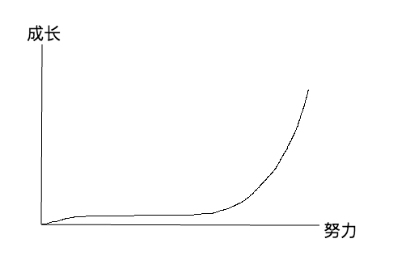

`认知力`是一种很重要的能力，它影响我们生活中的时时刻刻，无论当你聊天、工作、休息还是争论、学习和思考时它都默默的站在你身后。如果你能够注意到它将会获得一大人生财富。
<!-- more -->

### 是什么?

什么是认知力呢？就是你认识事物解决问题的一种能力，它直接影响你对世界的认知和判断。他是一个“万金油”是可以套用的，下面举几个例子：

当你看到诱人的广告时，你能快速分析广告中是否有虚假信息，知道哪些纯粹是为了诱惑你消费而撒的谎。要做到这一点需要一个能找出那些`泛词`的判断能力如：
> “xx牌安眠丸，30分钟见效”

这里的`见效`就是泛词需要注意了，什么是见效？30分钟开始起作用还是30分钟已经帮你入睡？它没有表述清楚，而大多数人都想当然的觉得是已经入睡，这可就上了广告的当，这时你需要去关注它真正的效果。能够警惕这些陷阱就是一种认知力。

如果你了解一些概率那么你应该知道什么是`独立事件`--就是指一件事情发生的概率是固定的，不会受到之前情况的影响。

这也是一个认知力，不知道大家有没有去过彩票店，你会发现好多彩票爱好者在店里各种计算，各种根据之前的出奖情况在推算这次可能出现的号码情况，如果你去搭讪他可能还可以给你说出各种理论和用这些理论中奖的案例。估计他没有`独立事件`这一认知力，也就是说每次中奖号码跟之前是一点关系都没有，不管你是如何推算也不会得到正确答案。

在说一个对我影响比较大的认知力（以前没有意识到），就是下面一个图

从该图可以看出努力和成长的关系，即：我们在一段长期的努力阶段可能是看不到明显的成长的，这个时候千万不要灰心，因为后面我们会发现有指数成长的现象。这个认知力被我用在了`阅读`、`练字`和其他大多跟学习有关的事物上，大多数人还是比较在乎当下的利益的，如果在短期内没有获得成就可能就放弃了，但是这个认知力让我有了坚持下去的动力。

### 为什么？

当然有人肯定会说：“好吧我并没有你说的这些认知力但是我一样能生活的很好；一样知道彩票的中奖率；一样会警惕一些广告陷阱那我为何还要去认知它？”

我的理由是认知力是多方面的，或许你在某些方面很出色（你可能不叫它认知力）但是你肯定不会在各种方面都出色，当你有了这个认知力--认知认知力的能力，那么你就可能留心生活和学习的各个方面，从而获取更多的认知力让自己变的强大。

举个栗子，如果你并非从事于设计行业，那么就会有一种情况是你能感知到设计的美，但是并不知道或者说自己并不能去设计这个的东西出来，为什么呢？当然是我们没有学习过相关知识，那是不是没有系统的学习就不能去设计？我觉得答案是否定的，系统的学习能让你精通某项技能，但是如果从使用的角度出发可能我们不需要系统的学习也能获得超过大多数人的能力。这对于一般人来说已经远远足够了。

那么有关于设计我有幸看到一本写给非设计从业人员的书《写给大家看的设计》里面提到了设计的4个原则`亲密`、`对齐`、`重复`和`对比`我这里大概的说明下，有兴趣的可以自己去看这本书，

* 亲密：将相关的项组织在一起，移动这些项，使它们的物理位置相互靠近，这样一来，相关的项将被看作凝聚为一体的一个组，而不再是一堆彼此无关的片段
* 对齐：任何元素都不能在页面上随意安放。每一项都应当与页面上的某个内容存在某种视觉联系
* 重复：“设计的某些方面需要在整个作品中重复”。重复元素可能是一种粗字体、一条粗线，某个项目符号、颜色、设计要素，某种格式、空间关系等
* 对比：“如果两个项不完全相同，就应当使之不同，而且应当是截然不同。”同样体现在颜色、大小等元素上

那么看完这本书，我们发现利用这4个原则能对我们的设计能力有很多的改善，这样我们就又获取了一个认知力，并能在你写的PPT上一展才能^_^。

### 怎么办？

既然认知力那么厉害我们如何提高自我的认知力呢？

我觉得有两点，一是我们能够认识到认知力这个概念，这样我们就会留意认知力；还一点就是广泛的阅读并学习，学习不能停呀！囧